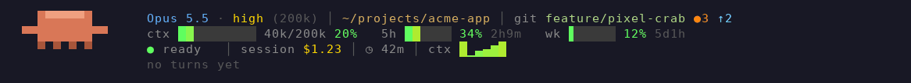

# pixelbar

An animated pixel-art status band for Claude Code, drawn above the prompt.



*Demo data, generated from pixelbar's own drawing code (`tools/pixelbar-demo/make-gif.sh`).*

## What it shows

| Row | What's there |
| --- | --- |
| 1 | Model and effort, context window size, folder, git branch with uncommitted (`●`) and unpushed (`↑`) counts |
| 2 | Context, 5-hour and weekly usage bars with time to reset; a warning if you'd hit the 5h limit before it resets at your current pace |
| 3 | Status (`working` / `ready` / mood), last test or build result, session cost, session time, context-usage sparkline |
| 4 | Live stats for the current turn, then the last turn's summary: time, tools, files and lines changed, cost |

The crab works along with Claude: it waves its claws while working, celebrates passing tests, worries about failures, turns red and sweats as the context fills, and falls asleep after 10 idle minutes.

More signals:

- **Context warning:** above 80% context the percentage blinks and `/compact?` appears.
- **Uncommitted-work nudge:** `⚑` when 10+ files are uncommitted, or changes have sat uncommitted for 30 minutes.
- **Files button:** `[ N files ]` appears once a file is edited, and opens the files pane.

## Commands

| Command | What it does |
| --- | --- |
| `/pixelbar` | Show or hide the band |
| `/session-files` | Open a pane listing the files edited this session, with their diffs (also the `[ N files ]` button, hotkey `f`) |
| `/focus-timer [minutes]` | Start a focus timer (default 25 minutes) shown under the crab; `/focus-timer off` stops it |

## Requirements

- A recent Claude Code (built on 2.1.289)
- `git`, for the git section and the uncommitted-work nudge
- A Pro or Max subscription, for the 5-hour and weekly bars
- A terminal font with good block characters

## Install

See the [repository README](../README.md#install).

## Develop

```bash
claude plugin validate pixelbar
claude plugin test pixelbar
tools/pixelbar-demo/make-gif.sh   # rebuild demo.gif after visual changes
```
